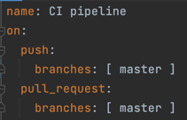

### Devops eksamen
I "Free" planen til GitHub er "branch protection" ikke tillat når et repository er privat. Det vil si at dere ikke kan konfigurere GitHub til å hindre push mot for eksempel main branch direkte, eller konfigurere regler for godkjenning før merge av pull request osv.
I denne oppgaven blir dere bedt om å beskrive hvordan dette kan gjøres, men dere trenger altså ikke konfigurere dette for repoet dere leverer.

Gå til fork > settings > branch protection > add > main > pull request before merge > require status check nefore merging > 
do not allow bypassing the above settings (gjør at man ikke kan gjøre merge hvis koden ikke kompilerer) + edit (på eksisterende) > 
require a pull request before passing > require approvals ( pull requests må godkjennes av andre)

# Bonusoppgave - 5 Poeng
Vi fant aldri ut av hvorfor ovnernevnte problem oppstår av og til med Maven i Cloud9. Hvis du klarer å reprodusere feilen konsekvent og kan komme med en forklaring på hvorfor dette skjer, og hva vi kan gjøre for å fikse det, gis 5 ekstra poeng.

java.lang.Error:
Unresolved compilation problem:
The method builder() is undefined for the type Cart
at no.shoppifly.CartServiceTest.shouldRemoveCartAfterCheckout(CartServiceTest.java:13)

maven i cloud 9.

## Del 1 DevOps-prinsipper - 20 poeng
Hva er utfordringene med dagens systemutviklingsprosess - og hvordan vil innføring av DevOps kunne være med på å løse disse? Hvilke DevOps prinsipper blir brutt?
Mer effektiv, koster mindre, mer samarbeid. Automatisering, Prinsipper som blir brutt er 

En vanlig respons på mange feil under release av ny funksjonalitet er å gjøre det mindre hyppig, og samtidig forsøke å legge på mer kontroll og QA. Hva er problemet med dette ut ifra et DevOps perspektiv, og hva kan være en bedre tilnærming?
En bedre tilnærming kan være å

Teamet overleverer kode til en annen avdelng som har ansvar for drift - hva er utfordringen med dette ut ifra et DevOps perspektiv, og hvilke gevinster kan man få ved at team han ansvar for både drift- og utvikling?
Å release kode ofte kan også by på utfordringer. Beskriv hvilke- og hvordan vi kan bruke DevOps prinsipper til å redusere eller fjerne risiko ved hyppige leveraner.

## Del 2 CI - 20 poeng
2.1 - yml - 

2.2 - mvn -B package vil kjøre med tester.

2.3 - Branch protection og status sjekker - Beskriv hva sensor må gjøre for å konfigurere sin fork på en slik måte at
Ingen kan pushe kode direkte på main branch
Kode kan merges til main branch ved å lage en Pull request med minst en godkjenning
Kode kan merges til main bare når feature branchen som pull requesten er basert på, er verifisert av GitHub Actions.

Gå til fork > settings > branch protection > add > main > pull request before merge > require status check nefore merging >
do not allow bypassing the above settings (gjør at man ikke kan gjøre merge hvis koden ikke kompilerer) + edit (på eksisterende) >
require a pull request before passing > require approvals ( pull requests må godkjennes av andre)

## Del 3 Docker - 20 poeng
3.1  - secrets, repo i docker hub blir laget automatisk når docker.yml bygger. Docker hub.

3.2 - endret Dockerfile, fjernet alt med maven (duplikat fra ci.yml) i yml-fil
spesifiser at man skal docker(image) på kjøre port 8080 fra terminal. 

3.3 - AWS > ECR > create new repo

## Del 4 Del - Metrics med Micrometer 20 poeng

## Del 5 Del - Terraform og CloudWatch Dashboards - 20 poeng

